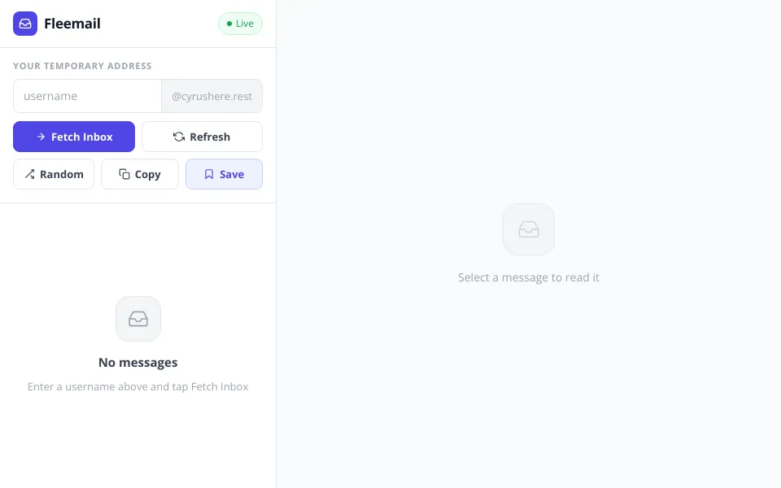

# Fleemail Web

A clean, responsive frontend for temporary inboxes. Fleemail lets users open an address, read incoming messages, save frequently used inboxes, and switch comfortably between desktop and mobile layouts.

**[Open the live app](https://fleemail.netlify.app)**



## Features

- Temporary inbox lookup
- Live inbox updates
- Safe email HTML rendering with DOMPurify
- Full message reading experience
- Saved inboxes stored locally in the browser
- Responsive desktop and mobile navigation
- Keyboard-friendly interactions

## Built with

- Semantic HTML
- Modern CSS
- Vanilla JavaScript
- Server-sent events
- DOMPurify
- Netlify

## Run locally

No build step is required. Serve the directory with any static file server:

```bash
npx serve .
```

Then open the URL printed in your terminal.

## Architecture

This public repository contains the browser interface. It communicates with the separately maintained Fleemail mail service over HTTPS. Mailbox credentials and server configuration are intentionally not part of this repository.

## Security

Incoming message HTML is sanitized before it is rendered. Do not commit mailbox credentials, API secrets, or private server configuration to this frontend repository.

## License

Released under the [MIT License](LICENSE).
